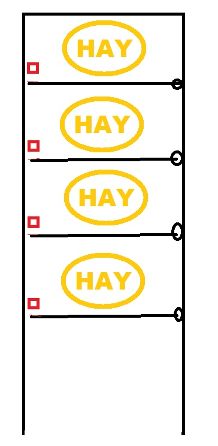

# Feed-O-Pony
Simple horse feeder timer 

## Table of Contents 

- [Purpose](#purpose)
- [Challenges](#challenges)
- [Example](#example)
- [Demo](#demo)
- [Team](#team)
- [Tools](#tools)
- [FAQ](#faq)

## Purpose

The idea came from Mr. J's sister's problem with the task of feeding horses. Them ponies are far away on their field and the trip would take unreasonably long to be taken many times a day. Commercial products for the purpose are quite costly. This initiated our challenge to make one of our own.

## Challenges

- The device should be cheap to make. 
- The device should have the robustness of a horse.
- The interface should be easy to use, learn and understand.
- Reloading the hay should be effortless.
- Making it should be a happy process

## Example

1. Horse-fanatic wants their mount to have "Well-fed status".
2. The Feed-O-Pony is installed and started.
3. Hay compartments are loaded and levers are lifted in place.
4. Horse-user selects the feeding interval by pressing the select button.
5. The sequence is started by pressing the start/stop button.
6. Feed-O-Pony releases a hay every set time for horses to feats on.
7. Program can be stopped by pressing start/stop button for 5 seconds.
8. After compartments are empty Feed-O-Pony stops.

## Demo
- LEDs represent electromagnetic locks controlled by relays
- Electromagnetic locks are show in Blueprint as red rectangles

## Team

* **Eero Vakiparta** - *Initial programming work* - [Feed-O-Pony](https://github.com/EeroVakiparta/Feed-O-Pony)
* **Mr. J** - *To be determined* 

## Tools
#### Software
- Arduino   *-  programming*
- PyxelEdit   *-  start animation*
#### Parts list
- Arduino Nano   *-  runs the logic*
- I2C 128X32 SSD1306 OLED Display   *-  cheap bright display*
- 4 Channel Relay Board   *-  to control almost any electronic on/off -device*
- USB power bank   *- the goal is to make feeder work with normal mobile phone power banks*

## FAQ

- Why?
-- For the greater good of horsies.
